# whoami

### Filipe Fernandes
#### ([ocefpaf]((https://github.com/ocefpaf)))


Oceanógrafo Físico por profissão, programador por acaso, educador por paixão.

<aside class="notes">
Formado desde 2003
Mudei de MatlabTM ara Python 2010
Primeira conferência de Python que atendi foi em 2012
</aside>


# ps aux != "work"

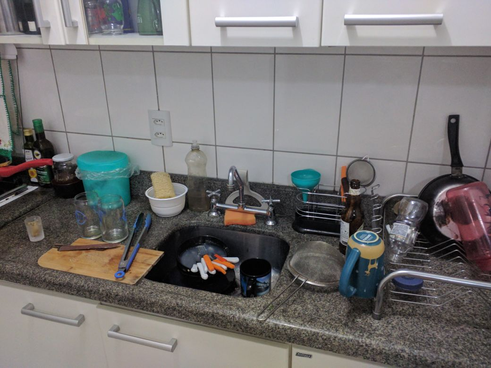

<aside class="notes">
Todos precisamos de um hobby.
Depois de mundo tempo procurando um desisti e fiquei com
a atividade de lavar louças!
</aside>


# O que é oceanografia?

(em 3 slides)

```python
slides = iter([1, 2, 3, 4])
next(slides)
```

>- um curso essencialmente científico com foco primariamente acadêmico;
>- bases em física, química, biologia, e geologia;
>- oceanógraf@s sabem um pouco de tudo, mas nada em profundidade.


<aside class="notes">
Escolhi por indecisão e não pela oceanografia.
Não me decepcionei ao encontrar a disciplina de ALGA.
</aside>

# `next(slides)`

O que todos acham que é:

. . .

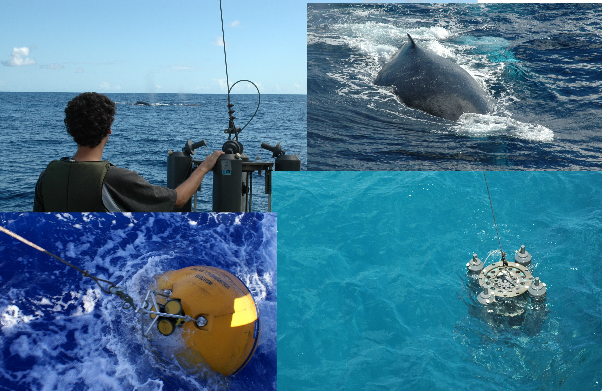


<aside class="notes">
Mar azul, baleias, equipamentos legais, pesquisa de ponta...
</aside>

# `next(slides)`

O que realmente é:

. . .


<aside class="notes">
Tentando fazer equipamentos antigos funcionar.
Trabalho pesado.
E sonecas, muitas sonecas!
</aside>

# `next(slides)`

Mas nem tudo é trabalho

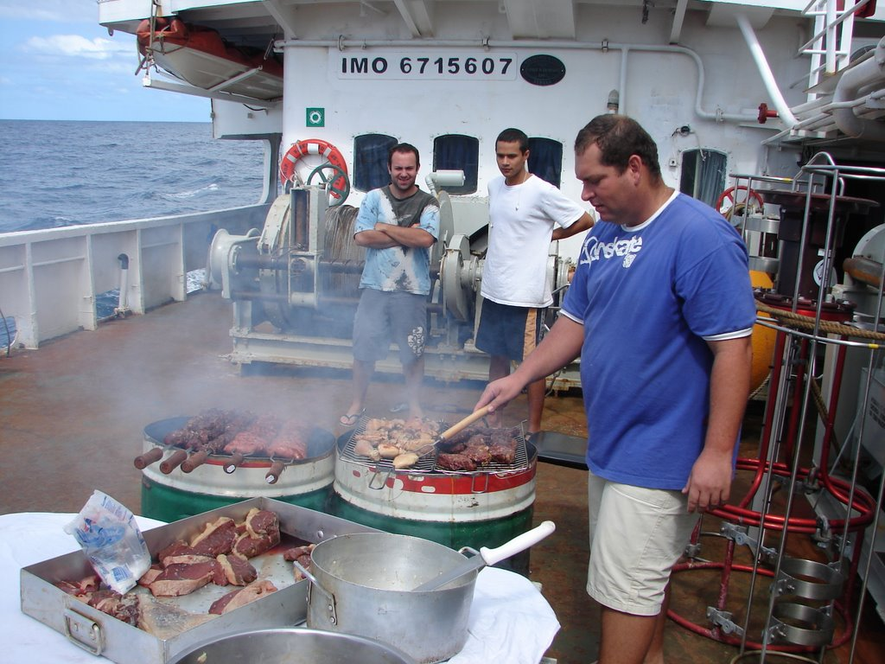


<aside class="notes">
Muitas horas ociosas de navegação entre atividades.
</aside>

# `next(slides)`

O mercado de trabalho...

. . .

```python
StopIteration
Traceback (most recent call last)
<ipython-input-8-943ae0641b78> in <module>()
----> 1 next(slides)

StopIteration:
```

<aside class="notes">
Academia está saturada.
O boom do petróleo e atividades embarcadas passou.
O profissional precisa se re-inventar.
Há lugar para um profissional com treinamento científico na indústria tech?
</aside>


# ps aux | grep "work"


<aside class="notes">
Software **is** eating the world.
É difícil achar profissionais dispostos a trabalhar com Software científico.
Exemplo da Disney/Dreamworks-JPL.
</aside>

# IOOS/RAs


<aside class="notes">
11 Associações regionais.
Todas mantêm servidores de dados,
modelos numéricos, toolboxes de processamento de dados.
Há uma grande demanda por programadores com algum domínio da área.
(Data Science phenomena? Ou O problema do astronauta?)
</aside>


# ps aux | grep "volunteer work"

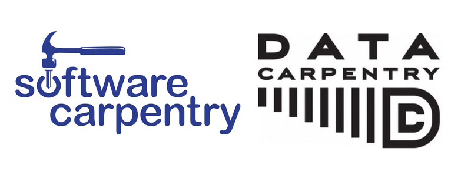


<aside class="notes">
Como resolver esse problema?
Todas as áreas precisam de conhecimento de jornalistas à médicos passando por todas as áreas da ciência.
</aside>


# ps aux | grep "academia"

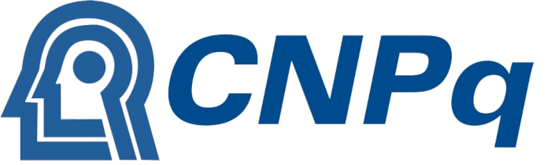


. . .


. . .

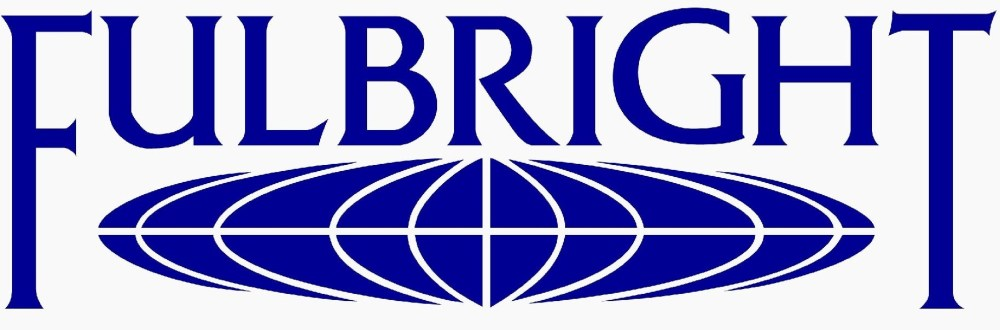


<aside class="notes">
Enquanto na acadêmia o que era valorizado?
Bolsista FAPERGS, CNPq, e ANP na graduação.
Bolsista FAPESP no mestrado.
Bolsista Fulbright no doutorado.
</aside>


# if bad_results: break

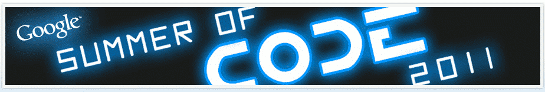

[climatecode](https://www.google-melange.com/archive/gsoc/2011/orgs/climatecode/projects/ocefpaf.html)


<aside class="notes">
Até o momento em que caiu a ficha da carreira acadêmica.
Comecei a valorizar outras coisas, como o GSoC.
O projeto ccc-gistemp tinha tudo que eu amava: escrever código, educar sobre mudanças climáticas, problemas oceanográficos.
</aside>


# Evasão da academia

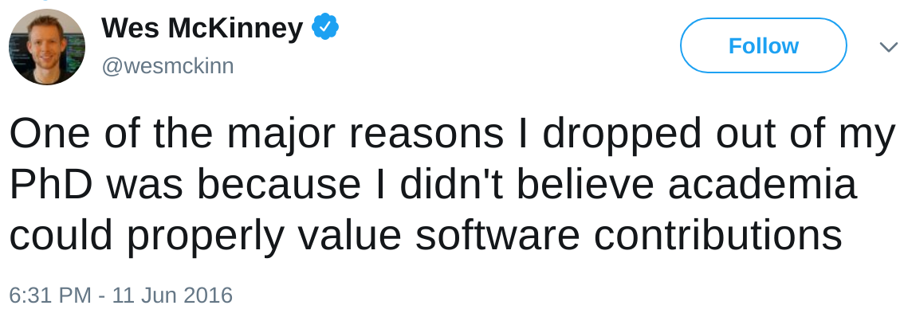


<aside class="notes">
Não fui o primeiro e não serei o último.
Os valores da academia são ótimos,
mas precisam ser revistos para o mundo moderno.
</aside>


# ps aux | grep "OSS work"

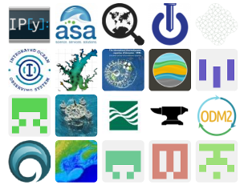


<aside class="notes">
Desde então dedico meu tempo à OSS.
Algumas organizações são por laços profissionais,
outras por diversão.
</aside>


# ps aux | grep "OSS work"

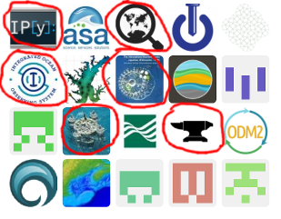


<aside class="notes">
Nos próximos slides focarei um pouco nessas orgs.
</aside>


#


>- Apenas uma inspiração para **não** programadores na audiência.
>- Projeto inicial era de um **oceanógrafo**!
>- Fernando Perez é **Físico** e desenvolveu o projeto durante o doutorado.
>- Minha participação foi pequena: `nbconvert`.


#

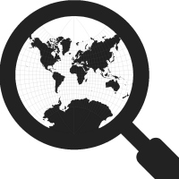

>- Comunidade do UK Met Office no GitHub.
>- Todo o trabalho deles é OSS.
>- Um exemplo de como um órgão governamental deve agir!

. . .

[https://github.com/SciTools](https://github.com/SciTools)


<aside class="notes">
Estão localizados numa ilha,
mas o trabalho desenvolvido lá é global.
</aside>


# Iris

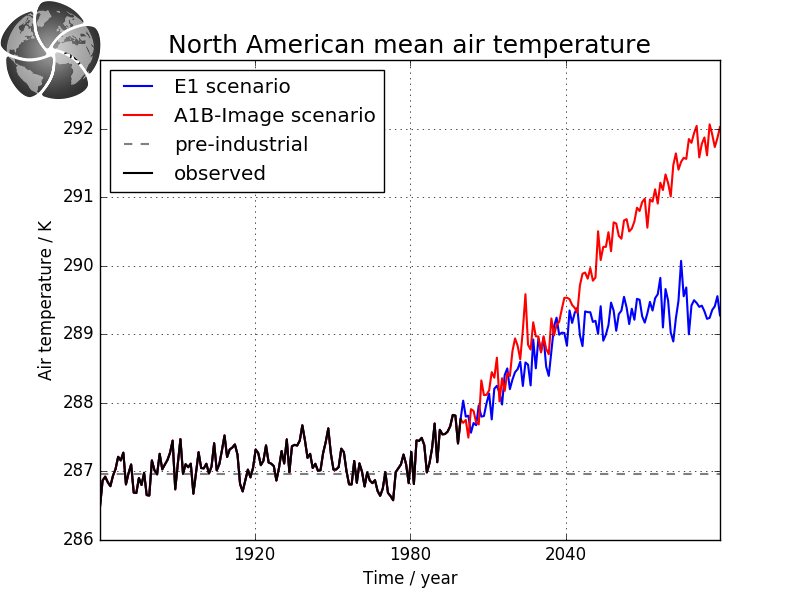


<aside class="notes">
Melhor leitor de dados Climate e Forecast.
Unificando workflows de cientistas no mundo todo.
Esse exemplo está disponível na documentação deles,
mostra duas simulações climáticas e os dados observados de temperatura do ar.
</aside>

# Cartopy

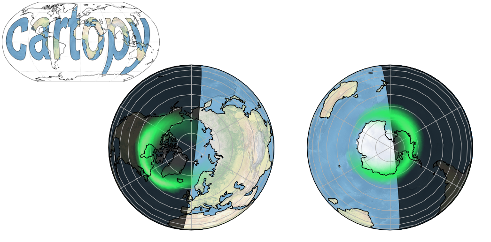


<aside class="notes">
Excelente Software para mapas.
O primeiro a resolver o problema do dateline.
Natural com matplotlib
(O UK Met office sustenta um desenvolvedor do mpl)
</aside>

#

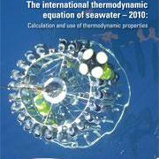

>- Começo turbulento
>- Muito academicismo e pouco Software
>- Suporte da UNESCO e SCOR/IAPSO Working group 127


<aside class="notes">
Depois de um excelente exemplo vem um não tão otimizado assim :-(
As tendências da acadêmia preveniram um bom desenvolvimento de Software.
</aside>


# 

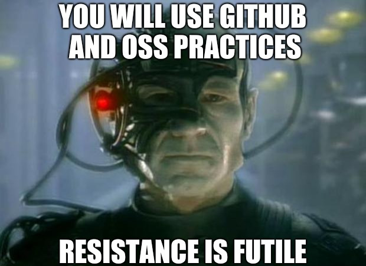


<aside class="notes">
Mas todo mundo cede eventualmente ao poder do OSS :-)
</aside>

#

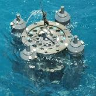

>- Uma organização aberta a toda comunidade oceanográfica que se interessa por programação.
>- A ideia é não ter vínculos com governo, empresas, universidades, etc.
>- Um espaço aberto à todos.

<aside class="notes">
Organização caseira.
Se tornou uma "Suíça" para projetos.
</aside>

# gridgeo

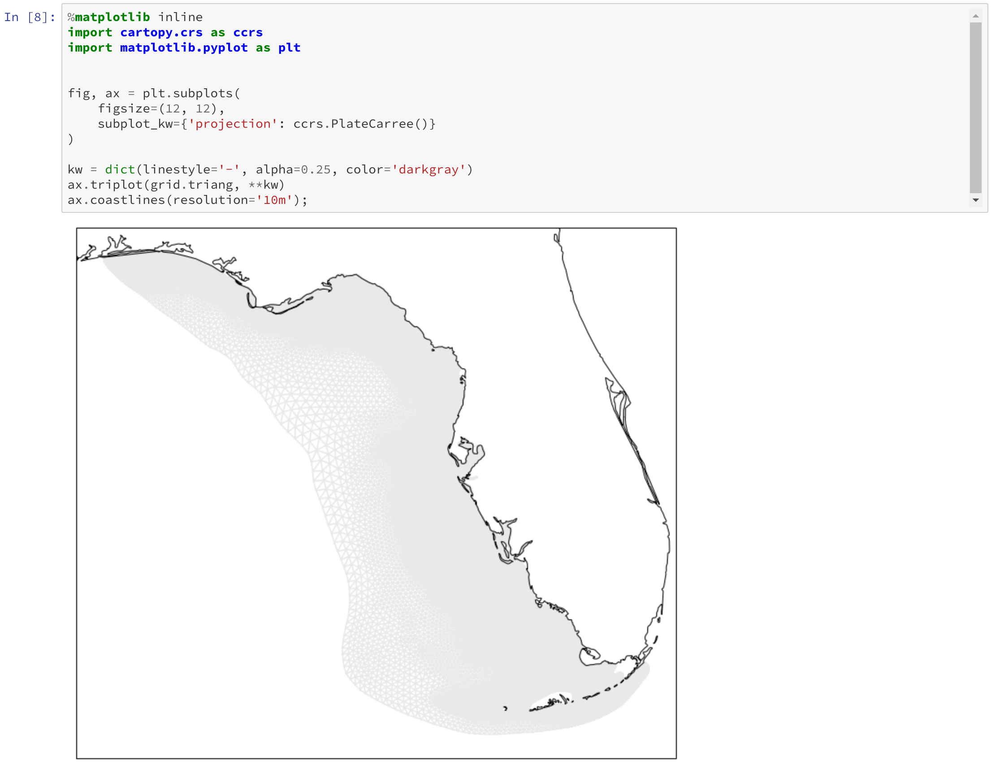


<aside class="notes">
Projeto que facilita a visualição de grades de modelos.
</aside>

# gridgeo

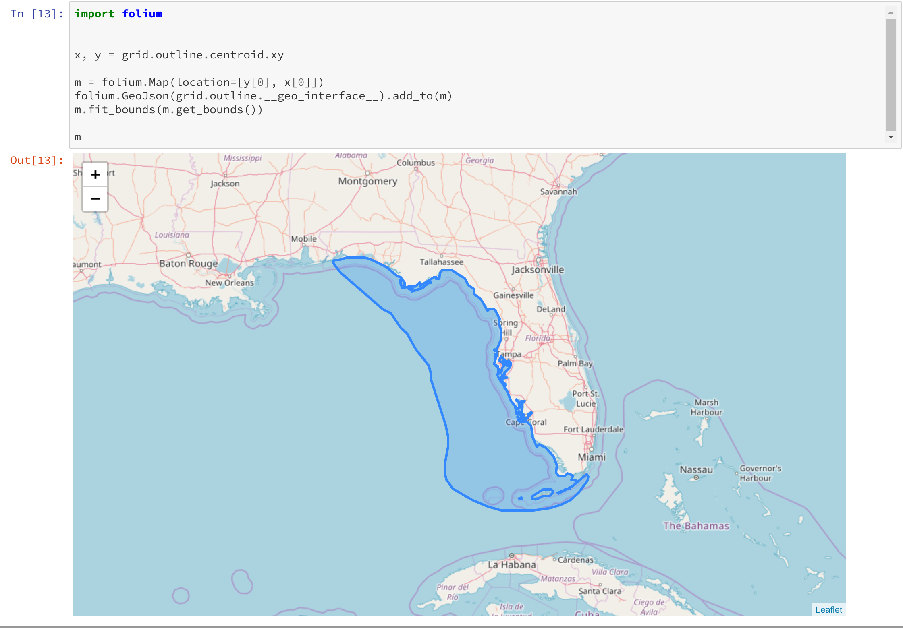


<aside class="notes">
Exporta para formatos vetorais.
web-friendly GeoJON.
</aside>

# python-ctd

```python
from ctd import DataFrame
cast = DataFrame.from_cnv('g01l06s01.cnv')
downcast, upcast = cast.split()
fix, ax = downcast['t090c'].plot()
```

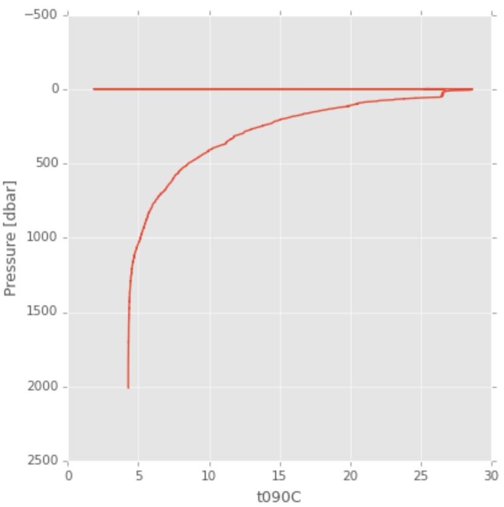


<aside class="notes">
Domínio específico.
Mas essencial para a qualidade de dados de Salinidade e Temperature
usados para estudos climáticos.
</aside>


# pocean-core

```python
attributes = {
  'global': {
    'title': 'Fake mooring',
    'summary': 'Vector current meter ADCP @ 10 m',
    'institution': 'Restaurant at the end of the universe',
    'cdm_timeseries_variables': 'station',
    'subsetVariables': 'depth',
  },
  'longitude': {
    'units': 'degrees_east',
    'standard_name': 'longitude',
  },
   ...
}
```

<aside class="notes">
Talvez o slide mais entediante que já fiz.
Mas esse tipo de conversão é essencial para a qualidade
dos bancos de dados. Metadata == love.
</aside>


# Metadata is love

```xml
netcdf fake_buoy {
  dimensions:
  	station = 1 ;
  variables:
  	double longitude(station) ;
  	longitude:axis = "X" ;
  	longitude:units = "degrees_east" ;
  	longitude:standard_name = "longitude" ;
  // global attributes:
  	:Conventions = "CF-1.6" ;
  	:cdm_data_type = "Timeseries" ;
  	:summary = "Vector current meter ADCP @ 10 m" ;
  	:institution = "Restaurant at the end of the universe" ;
    }
```


# erddapy

```python
from erddapy import ERDDAP

constraints = {'time>=': '2016-07-10T00:00:00Z',
               'time<=': '2017-02-10T00:00:00Z',
               'latitude>=': 38.0, 'latitude<=': 41.0,
               'longitude>=': -72.0, 'longitude<=': -69.0,}

variables = ['depth', 'temperature',]

e = ERDDAP(server='https://data.ioos.us/gliders/erddap',
    constraints=constraints,
    variables=variables,
)
```


<aside class="notes">
Python library para acessar dados ERDDAP.
Java library que serve dados por uma RESTful API.
Alguém imagina um mundo sem acesso a dados por uma REST API?
</aside>


# erddapy

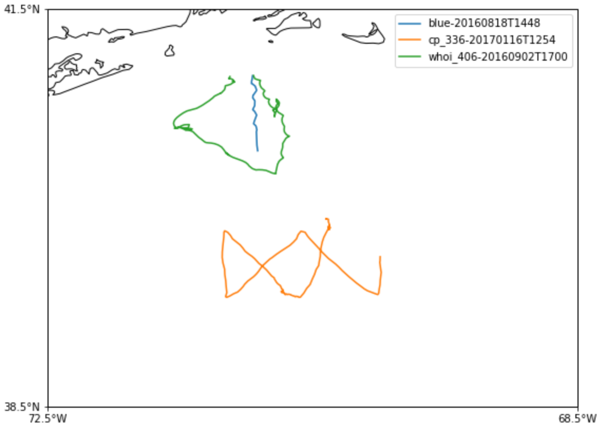


<aside class="notes">
Nesse exemplo buscamos dados de glider na MassBay
e plotamos as suas trajetórias.
</aside>


# folium


<aside class="notes">
Talvez o único Software de interesse direto ao publico geral.
Na colagem dos "tuítes" tem código de gente famosa.
Alguém consegue encontrar ;-p
</aside>


#

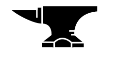

>- provavelmente o projeto de maior alcance fora de área de Met/Ocean
>- comunidade com crescimento orgânico e rápido
>- missão: facilitar a instalação de software

<aside class="notes">
O problema de "deployment" atinge todos,
com ou sem um diploma em CS.
</aside>


# Por que?

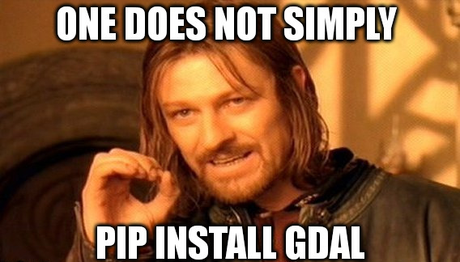


<aside class="notes">
Cientistas sofrem muito devido à workflows que dependem de
C/C++, Fortran, Python, etc.
</aside>


# community

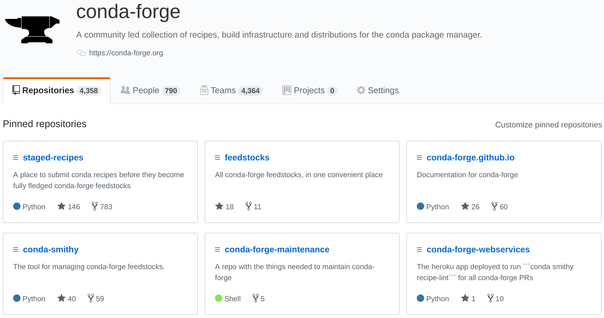


<aside class="notes">
A comunidade é fantástica.
Aprende-se algo novo todo dia.
790 pessoas, 4364 pacotes.
</aside>


# @conda-forge/core

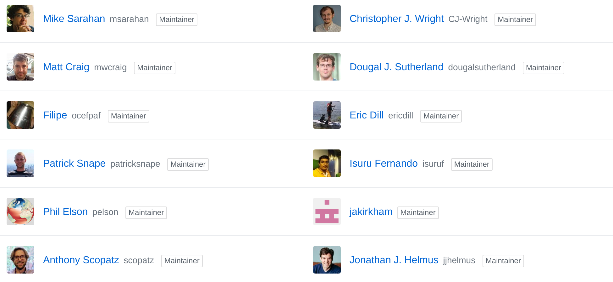


<aside class="notes">
Esses 12 são os membros do "núcleo."
</aside>

# objetivo

<div class="row">
<div class="column"></div>
<div class="column"></div>
</div>

<aside class="notes">
Erradicar problemas de instalação.
</aside>


#

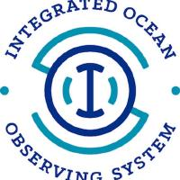

>- Segue os moldes do UK Met Office.
>- Gerencia Software, uso das tecnologias, dados, e projetos no GitHub.
>- O objetivo principal é melhorar a passagem do conhecimento através de várias gerências.

<aside class="notes">
Organização do meu "day job."
Ótimo exemplo onde política, Software, e ciência andam juntos.
</aside>


# Data Demo Center

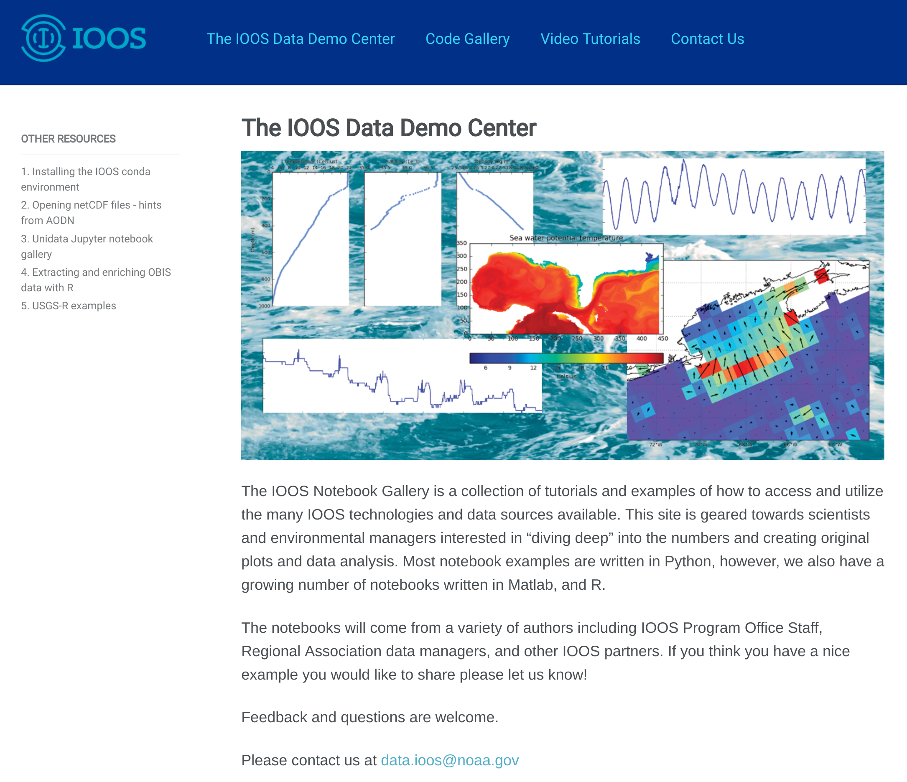


[https://ioos.github.io/notebooks_demos](https://ioos.github.io/notebooks_demos)


<aside class="notes">
Principal produto é um site de "extensão."
Visa mostrar ao público geral, cientistas, e tomadores de decisão como usar
os dados e Software disponíveis.
</aside>


# Code Gallery

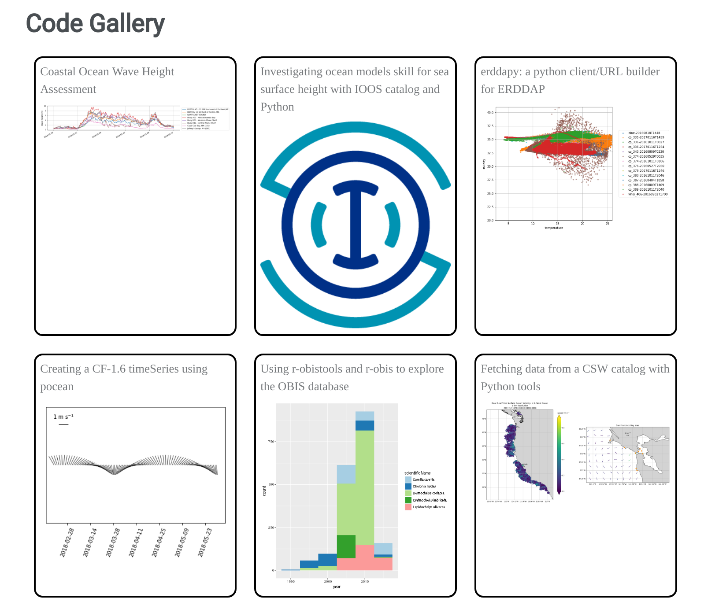

<aside class="notes">
Alguns dos exemplos de maior sucesso estão:
- Boston Light Swim.
- Comparação entre Modelo e Observação.
- Acesso a banco de dados.
</aside>


# Notebook time!

. . .

<a href="http://nbviewer.jupyter.org/github/ocefpaf/PythonSulKeynote/blob/gh-pages/notebooks/turtles.ipynb">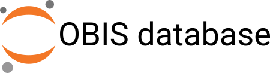</a>

. . .

<a href="http://nbviewer.jupyter.org/github/ocefpaf/PythonSulKeynote/blob/gh-pages/notebooks/wave_height_assessment.ipynb">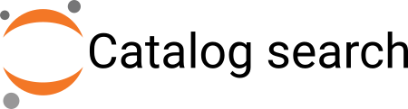</a>


. . .

<a href="http://nbviewer.jupyter.org/github/ocefpaf/PythonSulKeynote/blob/gh-pages/notebooks/gistemp.ipynb"></a>


# Já que o assunto é Ciência

>- Quantos aqui tem um diploma em ciência básica?
>- Quantos não mais praticam essa ciência no dia-a-dia?
>- Quem se (re-)encontrou na área de tecnologia/data science?


# Quem faz ciência?

>- constrói e organiza conhecimento
>- testa explicações sobre o universo:
>- sistematicamente,
>- objetivamente,
>- de forma transparente,
>- e reprodutível.


# Ciência conta com:

>- revisão pelos pares
>- ceticismo
>- transparência
>- atribuição
>- prestação de contas
>- colaboração
>- e impacto!


# Exemplo: missão da UFSC

Qualidade, Inovação, Atuação, Inclusão, Internacionalização,
Liberdade e responsabilidade, Autonomia, Democrática e plural,
Otimização administrativa, Transparência, Ética.

<aside class="notes">
Não é nem um pouco diferente do que é atualmente praticado nas comunidades de tecnologia aqui em Floripa.
</aside>


# O ponto é

Fazer ciência não é tão diferente assim de programação!


# Mas "codar" ciência não é fácil?

<iframe width="711" height="533" src="https://www.youtube.com/embed/ZyjCqQEUa8o?start=1771" frameborder="0" allow="encrypted-media" allowfullscreen></iframe>


<aside class="notes">
Ótima keynote do Jake sobre Python na Ciência
</aside>


# O que eu, profissional da tecnologia, tenho isso?

<iframe width="711" height="533" src="https://www.youtube.com/embed/kaGS4YXwciQ?start=1294" frameborder="0" allow="encrypted-media" allowfullscreen></iframe>


<aside class="notes">
Excelente keynote da Katy sobre o que programadores podem trazer para a ciência.
</aside>


# Por que devo me importar?

<div class="row">
<div class="column">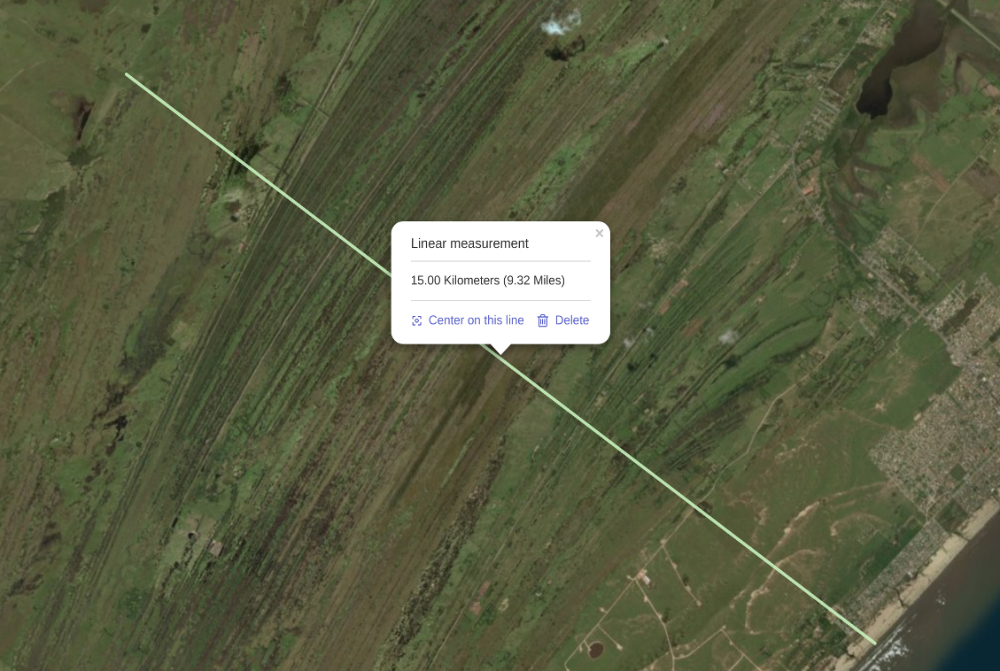</div>
<div class="column">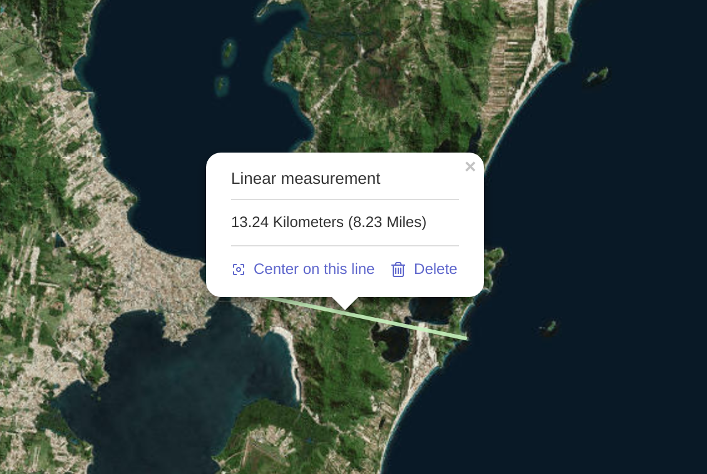</div>
</div>

[clique aqui para ver o notebook](http://nbviewer.jupyter.org/gist/ocefpaf/3f1765577d11e0cac3ee905e49936460)


<aside class="notes">
Nível do mar no passado (esquerda) por evidências geológicas,
extensão longitudinal de Floripa (direta).
</aside>


# Colocando a mão na massa!

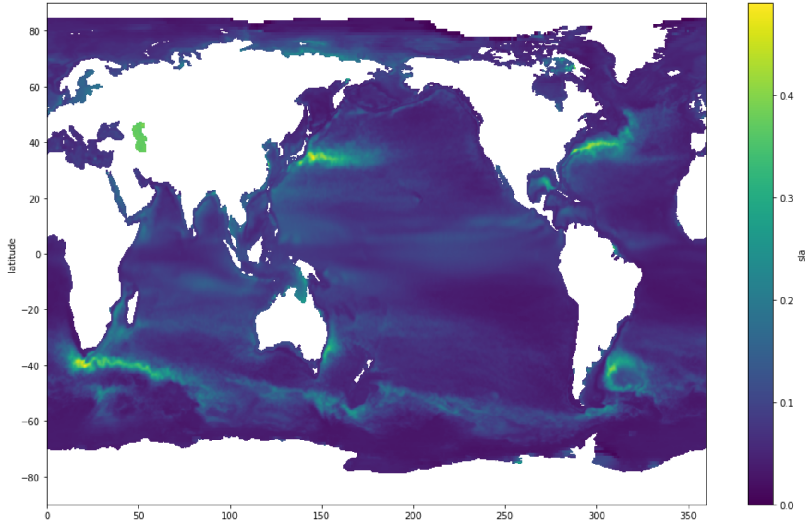


[http://pangeo.pydata.org](http://pangeo.pydata.org)


<aside class="notes">
Afinal como é a anomalia do nível do mar?
Consigo ver o mar subindo?
(Spoiler: não!)
</aside>


# sea-surface-height.ipynb

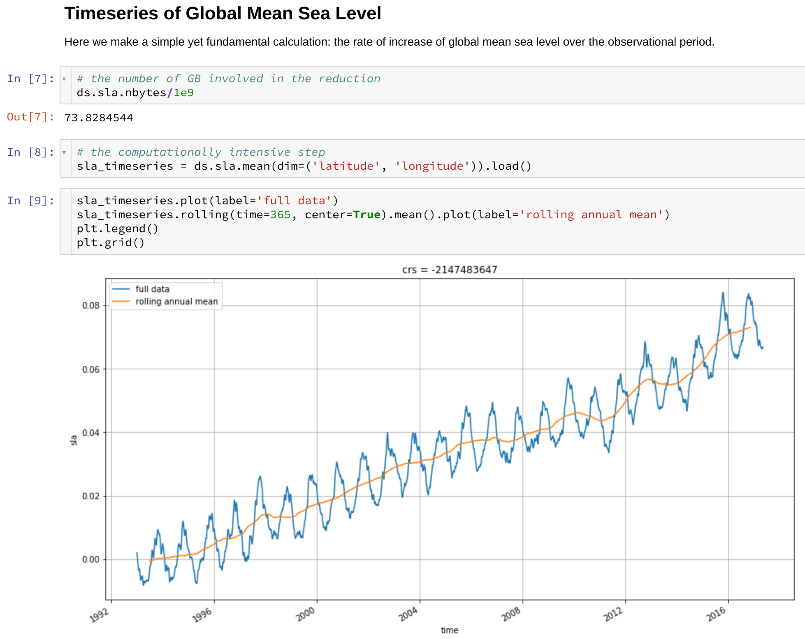


<aside class="notes">
Quer dizer, com um cluster, xarray, dask, kubernetes, data cloud,
e +70 Gigas de dados, sim!
</aside>

# sea-surface-height.ipynb

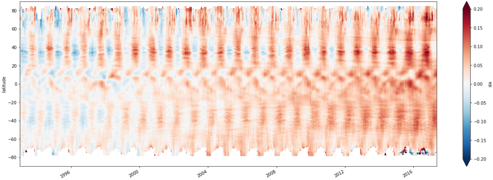

<aside class="notes">
Olhem para a nossa latitude.
</aside>


# *Scientific Software pledge*

>- Desenvolver Software aberto desde o início, sempre que possível.
>- Contribuir para a sustentabilidade do Software que uso e dependo.
>- Aplicar práticas propostas de engenharia de software de acordo com as necessidades e recursos reais do projeto.

<aside class="notes">
Todas aquelas tecnologias não se sustentam sozinhas.
A comunidade científica precisa de vocês!
</aside>


# *Scientific Software pledge..*

>- Ajudar os pesquisadores a melhorar a qualidade do seu software sem julgar.
>- Publicar as contribuições intelectuais do meu software de pesquisa.
>- Documentar (incluindo instruções de uso e exemplos de entrada e saída), pacotes, *releases*, e versões arquivadas do meu software.


# Resumo

>- É difícil conseguir unicórnios para programação científica.
>- Mas não precisamo de unicórnios, precisamos apenas de uma ponte entre programadores e cientistas.


# Perguntas?

