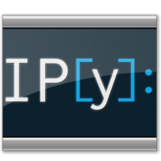

# whoami

### Filipe Fernandes
#### ([ocefpaf]((https://github.com/ocefpaf)))


Oceanógrafo Físico por profissão, programador por acaso, educador por paixão.

<aside class="notes">
Primeira conferência de Python que atendi foi em 2012
</aside>


# O que é oceanografia?

(em 3 slides)

```python
slides = iter([1, 2, 3, 4])
next(slides)
```

>- um curso essencialmente científico com foco primariamente acadêmico;
>- bases em física, química, biologia, e geologia;
>- oceanógraf@s sabem um pouco de tudo, mas nada em profundidade.


# `next(slides)`

O que todos acham que é:

. . .


# `next(slides)`

O que realmente é:

. . .


# `next(slides)`

Mas nem tudo é trabalho


# `next(slides)`

O mercado de trabalho...

. . .

```python
StopIteration
Traceback (most recent call last)
<ipython-input-8-943ae0641b78> in <module>()
----> 1 next(slides)

StopIteration:
```

<aside class="notes">
Academia está saturada
Boom do petróleo e atividades embarcadas passou
Formam 
O profissional precisa se re-inventar
</aside>


# ps aux | grep "work"


# IOOS/RAs


# ps aux | grep "volunteer work"


# ps aux != "work"


<aside class="notes">
Todos precisamos de um hobby.
Depois de mundo tempo procurando um desisti e fiquei com
a atividade de lavar louças!
</aside>


# ps aux | grep "academia"


. . .


. . .


# if bad_results: break


[climatecode](https://www.google-melange.com/archive/gsoc/2011/orgs/climatecode/projects/ocefpaf.html)


# Evasão da academia


# ps aux | grep "OSS work"


# ps aux | grep "OSS work"


#



>- Apenas uma inspiração para **não** programadores:
>- Projeto inicial era de um oceanógrafo!
>- Fernando Perez é Físico e desenvolveu o projeto durante o doutorado.
>- Minha participação foi pequena: `nbconvert`


#


>- Comunidade do UK Met Office no GitHub
>- Todo o trabalho deles é OSS
>- Um exemplo de como um órgão governamental deve agir!

. . .

[https://github.com/SciTools](https://github.com/SciTools)


# Iris


# Cartopy


#


>- Começo turbulento
>- Muito academicismo e pouco Software
>- SCOR/IAPSO Working group 127


# 


#


>- Uma organização aberta a toda comunidade oceanográfica que se interessa por programação.
>- A ideia é não ter vínculos com governo, empresas, universidades, etc.
>- Um espaço aberto à todos.


# gridgeo


# gridgeo


# python-ctd

```python
from ctd import DataFrame
cast = DataFrame.from_cnv('g01l06s01.cnv')
downcast, upcast = cast.split()
fix, ax = downcast['t090c'].plot()
```


# pocean-core

```python
attributes = {
  'global': {
    'title': 'Fake mooring',
    'summary': 'Vector current meter ADCP @ 10 m',
    'institution': 'Restaurant at the end of the universe',
    'cdm_timeseries_variables': 'station',
    'subsetVariables': 'depth',
  },
  'longitude': {
    'units': 'degrees_east',
    'standard_name': 'longitude',
  },
   ...
}
```


# pocean-core

```xml
netcdf fake_buoy {
  dimensions:
  	station = 1 ;
  variables:
  	double longitude(station) ;
  	longitude:axis = "X" ;
  	longitude:units = "degrees_east" ;
  	longitude:standard_name = "longitude" ;
  // global attributes:
  	:Conventions = "CF-1.6" ;
  	:cdm_data_type = "Timeseries" ;
  	:summary = "Vector current meter ADCP @ 10 m" ;
  	:institution = "Restaurant at the end of the universe" ;
    }
```


# erddapy

```python
from erddapy import ERDDAP

constraints = {'time>=': '2016-07-10T00:00:00Z',
               'time<=': '2017-02-10T00:00:00Z',
               'latitude>=': 38.0, 'latitude<=': 41.0,
               'longitude>=': -72.0, 'longitude<=': -69.0,}

variables = ['depth', 'temperature',]

e = ERDDAP(server='https://data.ioos.us/gliders/erddap',
    constraints=constraints,
    variables=variables,
)
```


# erddapy


# folium


#


>- provavelmente o projeto de maior alcance fora de área de Met/Ocean
>- comunidade com crescimento orgânico e rápido
>- missão: facilitar a instalação de software


# Por que?


# community


# @conda-forge/core


# objetivo


#


>- Segue os moldes do UK Met Office.
>- Gerencia Software, uso das tecnologias, dados, e projetos no GitHub.
>- O objetivo principal é melhorar a passagem do conhecimento através de várias gerências.

# Data Demo Center


[https://ioos.github.io/notebooks_demos](https://ioos.github.io/notebooks_demos)

# Code Gallery


# Notebook time!

. . .

<a href="http://nbviewer.jupyter.org/github/ocefpaf/PythonSulKeynote/blob/gh-pages/notebooks/turtles.ipynb"></a>

. . .

<a href="http://nbviewer.jupyter.org/github/ocefpaf/PythonSulKeynote/blob/gh-pages/notebooks/wave_height_assessment.ipynb"></a>


. . .

<a href="http://nbviewer.jupyter.org/github/ocefpaf/PythonSulKeynote/blob/gh-pages/notebooks/gistemp.ipynb"></a>


# Já que o assunto é Ciência

>- Quantos aqui tem um diploma em ciência básica?
>- Quantos não mais praticam essa ciência no dia-a-dia?
>- Quem se (re-)encontrou na área de tecnologia/data science?


# Quem faz ciência?

>- constrói e organiza conhecimento
>- testa explicações sobre o universo:
>- sistematicamente,
>- objetivamente,
- de forma transparente,
>- e reprodutível.


# Ciência conta com:

>- revisão pelos pares
>- ceticismo
>- transparência
>- atribuição
>- prestação de contas
>- colaboração
>- e impacto!


# Exemplo: missão da UFSC

Qualidade, Inovação, Atuação, Inclusão, Internacionalização,
Liberdade e responsabilidade, Autonomia, Democrática e plural,
Otimização administrativa, Transparência, Ética.

<aside class="notes">
Não é nem um pouco diferente do que é atualmente praticado nas comunidades de tecnologia aqui em Floripa.
</aside>


# E "codar" ciência?

<iframe width="711" height="533" src="https://www.youtube.com/embed/ZyjCqQEUa8o?start=1771" frameborder="0" allow="encrypted-media" allowfullscreen></iframe>


# O ponto é

Ciência não é tão diferente assim de programação!


# O que eu, profissional da tecnologia, tenho isso?

<iframe width="711" height="533" src="https://www.youtube.com/embed/kaGS4YXwciQ?start=1294" frameborder="0" allow="encrypted-media" allowfullscreen></iframe>


# Por que devo me importar?

<div class="row">
<div class="column"></div>
<div class="column"></div>
</div>

[clique aqui para ver o notebook](http://nbviewer.jupyter.org/gist/ocefpaf/3f1765577d11e0cac3ee905e49936460)


# Colocando a mão na massa!


[http://pangeo.pydata.org](http://pangeo.pydata.org)


# sea-surface-height.ipynb


# sea-surface-height.ipynb


# *Scientific Software pledge*

>- Desenvolver Software aberto desde o início, sempre que possível.
>- Contribuir para a sustentabilidade do Software que uso e dependo.
>- Aplicar práticas propostas de engenharia de software de acordo com as necessidades e recursos reais do projeto.

# *Scientific Software pledge..*

>- Ajudar os pesquisadores a melhorar a qualidade do seu software sem julgar.
>- Publicar as contribuições intelectuais do meu software de pesquisa.
>- Documentar (incluindo instruções de uso e exemplos de entrada e saída), pacotes, *releases*, e versões arquivadas do meu software.


# Perguntas?

